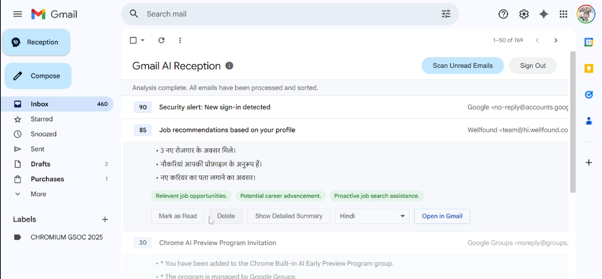
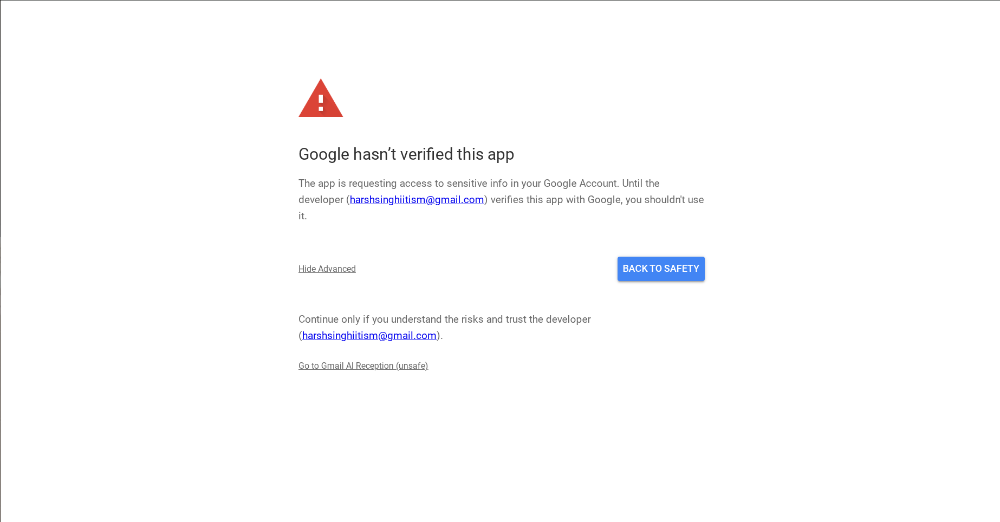

# Basic Idea

For many users, managing a personal inbox has become a significant source of inefficiency and stress. A high volume of non-essential correspondence, such as promotions and automated announcements, clutters the inbox and obscures critical messages. Standard unsubscribe features often fail to prevent persistent senders from reaching the inbox through different addresses, and native tools like labels and filters are often underutilized by casual users or are ineffective against new, important senders (ultimately forcing users to skim every email).  

In addition to solving this issue, we can also present emails more concisely, highlighting the most important details.

That’s what inspired the idea of a **Gmail AI Receptionist Chrome Extension** — a smart, empathetic assistant designed to help casual users focus on what truly matters.  

It automatically analyzes and scores incoming emails based on your past activity, distinguishing crucial messages from the clutter. Each important message is summarized in your preferred language, making it quick and effortless to grasp the key points. Most importantly, it learns from your responses, continuously refining its accuracy and adapting to your unique priorities over time.

---

## Current Analysis Criteria

Currently, its analysis is based on the following criteria:
- `highPrioritySenders`
- `highPriorityKeywords`
- `lowPrioritySenders`
- `lowPriorityKeywords`

---

## Initialization & UI Injection

- Injects the **"Reception"** button into the Gmail navigation menu.  
- Shows the extension's view when the URL hash changes to `#reception`.

---

## Authentication

- Prompts for **Google Sign-In** to get an authentication token when the user clicks **"Sign In"**.  
  *(Google OAuth 2.0)*

---

## AI Analysis Pipeline

- Generates a user profile by having the AI analyze past important, unread, and trashed emails.  
- Saves the profile to Chrome storage for 24 hours to speed up future scans.  
- Fetches all unread emails from the last **4 days** to be scored.  
  *(We can increase the days; I’ve kept it short for the demo showcase.)*  
- Sends emails to the AI in small batches for scoring.  
- Live-updates the UI as each batch is processed and scored.

---

## Display & User Actions

- Renders analyzed emails as cards, sorted by their AI-generated score and scoring reasons. *(Prompt API)*  
- Allows users to expand cards to see an AI-generated summary. *(Summarizer API)*  
- Provides buttons to delete, mark as read, or open emails directly in Gmail. *(Gmail API)*  
- Includes a dropdown to translate the email summary into other languages. *(Translator API)*

---

## 📂 UI

---

## 🧠 Google Hasn't Verified so please feel free to trust :)
